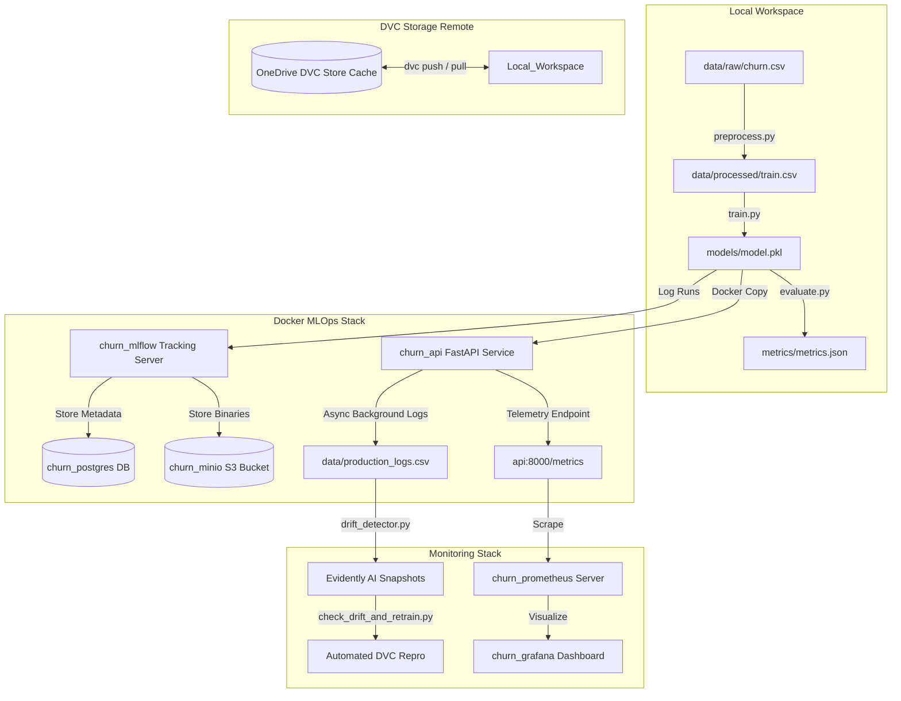

# Production-Ready Customer Churn Prediction System: An Enterprise-Grade MLOps Implementation

This whitepaper details the architectural design, implementation workflows, mathematical foundations, and operational mechanics of the Customer Churn Prediction System. It covers all five phases of development—from setting up reproducible data pipelines to deploying a dockerized real-time monitoring and retraining loop.

---

## 1. Executive Summary & System Architecture

### The Business Problem
Customer churn (cancellation of services) directly impacts recurring revenue. Retaining an existing customer is significantly more cost-effective than acquiring a new one. By leveraging the **IBM Telco Churn Dataset**, this system builds a predictive model that identifies high-churn-risk customers before they cancel, enabling marketing and sales teams to target them with retention incentives.

### The Technical Objective
A typical data science workflow ends in a Jupyter Notebook. This project implements a production-grade **MLOps (Machine Learning Operations)** architecture, ensuring:
1.  **Reproducibility**: Code versioning is separated from data versioning using DVC (Data Version Control).
2.  **Tracking & Registry**: Hyperparameters, artifacts, and training metrics are registered in a central repository using MLflow.
3.  **Scalable Serving**: A high-performance FastAPI microservice serves predictions, optimized to eliminate disk read latency.
4.  **CI/CD Automation**: GitHub Actions lint code, run integration tests, and build Docker containers automatically.
5.  **Observability & Drift Control**: Live API requests are monitored using Prometheus and Grafana, while feature distributions are evaluated for data drift using Evidently AI to trigger automated retraining.

### Architectural Diagram
The layout below illustrates how data and telemetry flow through the active containers and filesystems:



---

## 2. In-Depth Walkthrough of the Five Phases

### Phase 1: Foundational MLOps Setup
The foundation enforces coding standards, reproducibility, and version alignment across developers.
*   **Git Strategy**: Organized on `master` and `develop` branches.
*   **DVC Integration**:
    *   Git is inefficient at tracking large binaries (like CSVs or model weights). DVC abstracts these files by creating tiny `.dvc` pointer files tracked in Git, while the actual binaries are stored in an external DVC Cache.
    *   We configured the DVC remote at a local subdirectory `C:\Users\HP\OneDrive\Documents\dvc-store` representing a shared enterprise cloud storage mock.
*   **Pre-commit Hooks**:
    *   Configured via `.pre-commit-config.yaml` using hooks to run:
        *   `trailing-whitespace`: Cleans trailing whitespace.
        *   `end-of-file-fixer`: Ensures files end with a newline.
        *   `black`: Enforces PEP 8 python code formatting.
        *   `isort`: Standardizes import grouping and alphabetical ordering.
        *   `flake8`: Performs syntax checks and enforces line-length constraints.

---

### Phase 2: Reproducible Data & Model Training Pipelines

#### Data Ingestion (`src/data/ingest.py`)
Downloads the raw dataset from a public remote repository and saves it to `data/raw/churn.csv`. DVC tracks this stage to prevent redundant downloads if the source URL remains unchanged.

#### Data Preprocessing (`src/data/preprocess.py`)
1.  **Handling Missing Values**: The `TotalCharges` column has missing string values (`" "`) for customers with `tenure = 0`. The script coerces these to numeric, filling missing values with the corresponding `MonthlyCharges` value.
2.  **Categorical Encoding**: Categorical columns (like `gender`, `Partner`, `Contract`) are mapped to numeric values using Scikit-Learn's `LabelEncoder`.
3.  **Standard Scaling**: Numerical columns (`tenure`, `MonthlyCharges`, `TotalCharges`) are normalized.
    $$\text{Scaling formula: } z = \frac{x - \mu}{\sigma}$$
    where $\mu$ is the feature mean and $\sigma$ is the standard deviation. Normalization prevents features with large scales (like `TotalCharges`) from dominating model gradients.
4.  **Dataset Splits**: Data is split into training (70%), validation (10%), and testing (20%) sets.

#### Handling Class Imbalance
The dataset is imbalanced (only ~26% of customers churn). Left untreated, a model will default to predicting "No Churn" and still achieve high accuracy while failing to detect actual churners. We address this using the XGBoost hyperparameter `scale_pos_weight`:
$$\text{scale\_pos\_weight} = \frac{\text{Count of Negative Class (No Churn)}}{\text{Count of Positive Class (Churn)}} \approx 3$$
This penalizes the loss function three times more when the model misclassifies a churning customer.

#### Model Training & Evaluation (`src/models/train.py` & `evaluate.py`)
*   **Model**: XGBoost Classifier. Hyperparameters (`n_estimators`, `max_depth`, `learning_rate`) are loaded from `params.yaml`.
*   **Early Stopping**: Configured for 20 rounds on the validation set using `eval_metric: auc` to prevent overfitting.
*   **Evaluation Metrics**: Evaluated on the held-out test split, writing metrics (Accuracy, AUC, F1, Precision, Recall) to `metrics/metrics.json`.

#### Dockerized MLflow Infrastructure
*   **PostgreSQL**: Stores run parameters, tags, and metric timelines.
*   **MinIO**: An S3-compatible object store. MLflow uploads the trained model binary (`model.pkl`) and preprocessing artifacts (`standard_scaler.pkl`, `label_encoders.pkl`) to the bucket `s3://mlflow-artifacts/`.
*   **The Setuptools Bug**: MLflow relies on `pkg_resources` to determine package versions. Newer releases of `setuptools` (v82+) removed `pkg_resources`. This caused the MLflow container to crash on startup. We resolved this by building a custom MLflow Docker image and pinning `setuptools<82` to preserve compatibility.

---

### Phase 3: High-Performance Serving Infrastructure

#### The Caching & Preprocessor Latency Problem
In production, a REST API must respond in milliseconds. Standard serving scripts load the training dataset from disk on every request to extract column structures, which is slow.
*   **The Solution (`src/models/predict.py`)**: We eliminated all disk reads by saving the expected model features directly inside the trained model using `model.feature_names_in_`.
*   **In-Memory Cache**: The model and preprocessors are loaded once on startup and cached using Python's `@lru_cache(maxsize=1)`. Subsequent requests retrieve the model from RAM.

#### FastAPI microservice (`api/main.py`)
*   Exposes `/health` for Kubernetes/Docker health checks.
*   Exposes `/predict` accepting a JSON payload validated against the Pydantic schema `CustomerFeatures`.
*   **Asynchronous Logging**: Incoming requests must be logged to a CSV database (`data/production_logs.csv`) for data drift checks. Writing to disk synchronously slows down the response time. We solved this by using FastAPI's `BackgroundTasks`, which returns the prediction immediately to the client and appends the request details to the CSV file asynchronously.

---

### Phase 4: CI/CD Automation

#### GitHub Actions Pipelines
*   **Continuous Integration (`ci.yml`)**: Triggered on pushes/PRs to `develop`. Installs dependencies, runs style checkers (`black`, `isort`, `flake8`), and executes the pytest test suite inside `tests/test_api.py`.
*   **Continuous Deployment (`cd.yml`)**: Setup using `iterative/setup-dvc` to authenticate with our storage remote. Before building the Docker image, it runs `dvc pull` to download the registered model weights and preprocessors from the remote store, copying them directly inside the final API Docker container.

#### Makefile Automation
Standardizes commands for local developers:
*   `make format` / `make lint`: Automatically formats and checks style.
*   `make test`: Runs pytest with coverage reporting.
*   `make train`: Runs `dvc repro` with proper UTF-8 shell parameters.
*   `make docker-up` / `make docker-down`: Controls the local microservice stack.

---

### Phase 5: Monitoring, Observability, & Closed-Loop Retraining

#### Data Drift Detection (`src/monitoring/drift_detector.py`)
As consumer behavior changes over time, live production data drifts away from the training distribution. This degrades model accuracy (model decay).
*   **Evidently AI**: Compares the feature distributions in `data/production_logs.csv` against the training baseline `train.csv`.
*   **Evidently 0.7+ API**: We adapted the code to use the new `Snapshot` model returned by `Report.run()`. It retrieves drift metrics (`count` and `share`) from `snapshot.dict()["metrics"][0]["value"]` and saves HTML reports.
*   **Drift Divergence Metrics**:
    *   **Numerical features** (like `MonthlyCharges`): Evaluated using the **Kolmogorov-Smirnov (KS) test** (which checks if two samples come from the same continuous distribution).
    *   **Categorical features** (like `PaymentMethod`): Evaluated using **Jensen-Shannon (JS) Divergence** (which measures the similarity between two probability distributions).

#### API Telemetry (Prometheus & Grafana)
*   **Prometheus**: Scrapes `api:8000/metrics` every 5 seconds.
    *   `api_requests_total` (Counter): Tracks HTTP status codes.
    *   `api_request_latency_seconds` (Histogram): Computes response times.
    *   `churn_predictions_total` (Counter): Tracks true vs false predictions.
    *   `churn_probability` (Histogram): Captures churn probability distributions.
*   **Grafana**: Configured with a default Prometheus datasource. We created a custom dashboard (`grafana/dashboards/churn_dashboard.json`) showcasing real-time prediction rates, p95 latencies, and output distributions.

#### Closed-Loop Retraining (`src/monitoring/check_drift_and_retrain.py`)
Checks `metrics/drift_metrics.json`. If `dataset_drift_detected` is `True` (e.g. drift share $\ge 30\%$), the script automatically executes a subprocess calling the active python interpreter:
```python
subprocess.run([sys.executable, "-m", "dvc", "repro"], env=env)
```
This automatically retrains the model on the updated data and logs the new version to MLflow, closing the MLOps loop.

---

## 3. Comprehensive Dependency Analysis

Below is an analysis of what each dependency does and why it is critical:

### Core Data & Machine Learning
*   **pandas (`==2.3.3`)**: Provides DataFrame structures for manipulating tabular data, preprocessing files, and reading CSV logs.
*   **numpy (`==2.4.6`)**: Handles efficient array structures and vectorized calculations used in preprocessing scaling.
*   **scikit-learn (`==1.9.0`)**: Provides standard data transformers (`StandardScaler`, `LabelEncoder`) used in feature mapping.
*   **xgboost (`==3.3.0`)**: The core classification algorithm. Trains trees using gradient boosting.
*   **imbalanced-learn (`==0.12.0`)**: Extends scikit-learn for handling class imbalances.

### Model Management & Pipelines
*   **mlflow (`==3.14.0`)**: Handles experiment runs, parameter logging, and registers model versioning artifacts.
*   **dvc & dvc-s3 (`==3.67.1`)**: Implements git-like tracking for data files and connects DVC to MinIO/S3 remotes.
*   **boto3 (`==1.43.34`)**: The AWS SDK for Python. Required by DVC and MLflow to upload files to MinIO.

### Serving & Monitoring
*   **fastapi (`>=0.111.0`)**: An asynchronous web framework for building APIs.
*   **uvicorn (`>=0.29.0`)**: The ASGI web server that runs the FastAPI application.
*   **pydantic (`>=2.7.0`)**: Enforces validation schemas on HTTP request JSON payloads.
*   **prometheus-client (`>=0.20.0`)**: Exposes API performance and prediction counts on a scrape endpoint.
*   **evidently (`>=0.4.30`)**: Compares datasets to generate HTML and JSON reports on data drift.
*   **xhtml2pdf & markdown**: Converted this whitepaper document into a formatted PDF file.

---

## 4. Complete Operational Command Guide

### 1. Setup & Environment
Activate the environment:
```powershell
conda activate churn-mlops
```

### 2. Infrastructure Control
Start the Postgres, MinIO, MLflow, API, Prometheus, and Grafana containers:
```powershell
docker-compose up -d --build
```
Stop all containers:
```powershell
docker-compose down
```

### 3. Running Pipelines
Run the entire DVC ingestion, preprocessing, training, and evaluation pipeline:
```powershell
$env:PYTHONIOENCODING="utf-8"; $env:PYTHONUTF8="1"
python -m dvc repro
```

### 4. Simulating live production traffic
Send 150 requests (simulating customer profile updates) to populate logs and update Prometheus:
```powershell
python src/monitoring/generate_traffic.py --num-requests 150 --delay 0.05
```

### 5. Running Drift Checks
Compare live request logs against the training baseline:
```powershell
python src/monitoring/drift_detector.py
```
*   View output metrics: Check `metrics/drift_metrics.json`
*   View HTML report: Open `metrics/drift_report.html` in your browser.

### 6. Checking and Retraining
Check drift metrics and trigger retraining only if drift is detected:
```powershell
python src/monitoring/check_drift_and_retrain.py
```
Force retraining (triggers DVC reproduction immediately):
```powershell
python src/monitoring/check_drift_and_retrain.py --force
```
